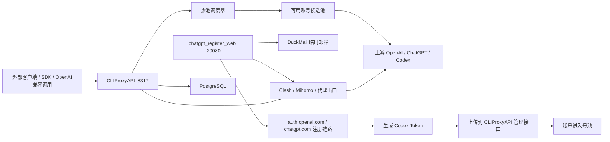
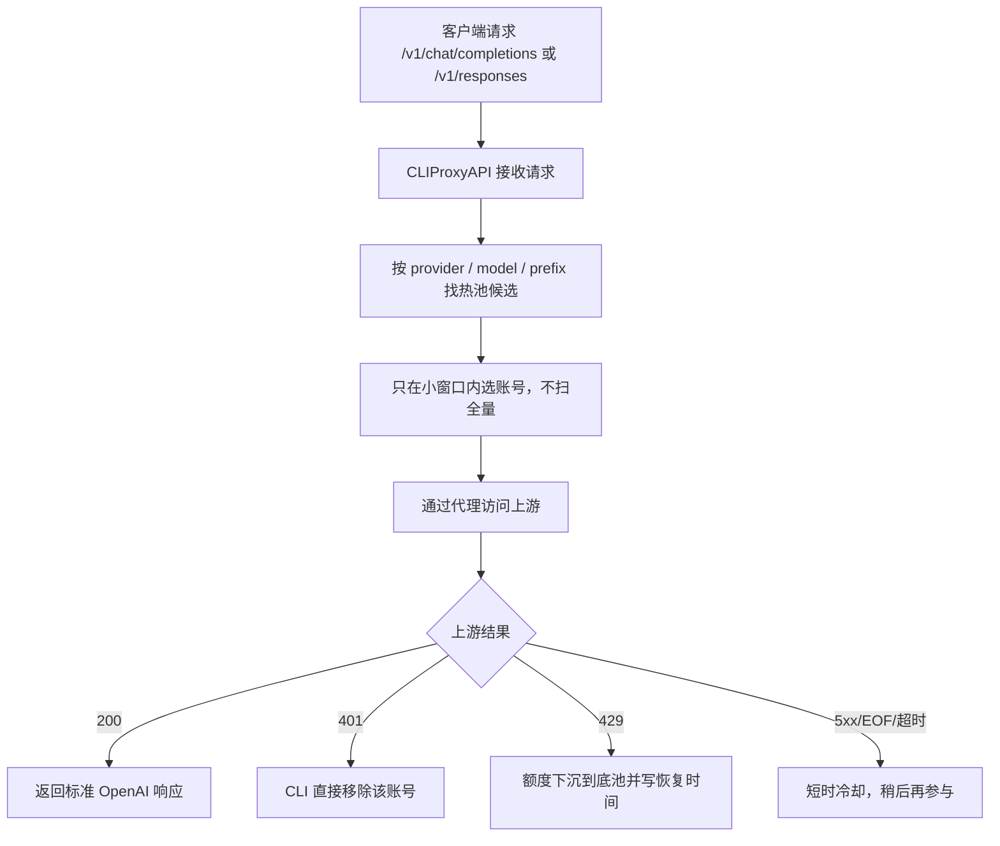
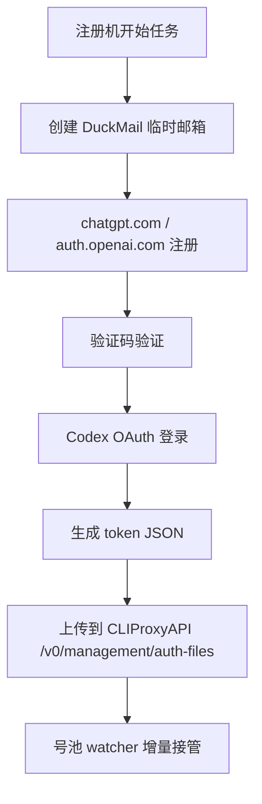

# GPTmax

`GPTmax` 是一套围绕 `CLIProxyAPI` 构建的生产化账号池系统，目标不是“单机能跑”，而是把以下三件事拆清楚：

- 网关热路径稳定对外提供 OpenAI 兼容接口
- 注册机只负责注册和上传新号
- 账号生命周期统一交给网关处理

当前仓库是一个整合后的 monorepo，包含：

- `CLIProxyAPI/`
- `chatgpt_register_web/`
- `Clash/`

这个仓库已经做过脱敏处理，不包含线上运行中的密钥、账号文件、PG 本地缓存、运行日志和代理实时配置。

## 仓库结构

```text
GPTmax/
├── CLIProxyAPI/             # 网关、管理 API、账号调度、状态机
├── chatgpt_register_web/    # 注册机 Web UI，只负责注册与上传
├── Clash/                   # Mihomo/Clash 代理侧脚本与配置目录
└── README.md                # 当前文档
```

## 系统定位

这套系统不是“注册机 + 网关都去碰账号状态”，而是明确分层：

- `chatgpt_register_web`：负责注册新账号、拿到 Codex token、把 token 上传进号池
- `CLIProxyAPI`：负责对外接口、账号选择、401 删除、额度下沉、额度恢复、冷却和恢复
- `Clash`：负责代理节点选择和上游网络出口

换句话说：

- 注册机负责“产号”
- 网关负责“用号”和“判号”
- 代理负责“出网”

## 当前架构



## 核心流程

### 1. 外部调用流程



### 2. 注册上传流程



## 组件说明

### CLIProxyAPI

位置：

- `CLIProxyAPI/`

职责：

- 对外提供 OpenAI 兼容 API
- 管理账号池、热池、模型路由
- 处理 401、429、5xx、EOF、refresh 失败等账号状态变化
- 提供管理页和分页管理接口

当前已经落地的关键行为：

- 不再全量扫描账号做热路径选取
- 管理页走服务端分页
- `401` 请求期失败会直接移除账号
- `429` 额度耗尽会下沉，不参与热池，等恢复时间自动回来
- refresh 永久失败会标记为 `token_invalid`

### chatgpt_register_web

位置：

- `chatgpt_register_web/`

职责：

- 只负责注册新账号
- 只负责上传新 token 到号池
- 不再负责探测、清理、同步、守护生命周期

当前设计原则：

- 注册机是“生产者”
- 网关是“消费者 + 生命周期管理者”
- 不让注册机和网关同时去判断坏号

### Clash

位置：

- `Clash/`

职责：

- 负责代理订阅更新
- 负责代理组、自动测速、出口选择
- 给注册机和网关提供统一出网能力

## PostgreSQL 的作用

很多人会误以为 PG 是热路径数据库。这里不是。

PG 在这套系统里主要负责两件事：

### 1. 持久化

- 保存账号记录
- 保存管理索引
- 保存 CLIProxyAPI 重启后要恢复的状态基础

### 2. 管理页索引层

- 管理页分页
- 搜索
- lookup
- 统计

它**不是**每个模型请求都要查的数据库。

模型请求热路径主要依赖：

- 内存里的 auth 状态
- scheduler
- 模型注册表

所以正确理解是：

- 热路径：内存
- 管理路径：PG + 分页接口
- 冷存储：auth 文件 / token 文件

## 账号生命周期定义

当前推荐且已基本实现的策略：

- `401 / unauthorized`
  - 视为坏号
  - 直接移除出池
- `429 / quota exhausted`
  - 视为额度耗尽
  - 下沉到底池
  - 到恢复时间自动回热池
- `refresh 永久失败`
  - 标记 `token_invalid`
  - 不再参与选择
- `EOF / transient upstream error / 5xx`
  - 视为临时问题
  - 短期冷却
  - 之后再尝试

## 快速启动

下面是当前推荐的启动顺序。

### 1. 启动代理

```bash
cd Clash
chmod +x ./start.sh
./start.sh
```

默认可用代理端口以你的 `Clash/config/config.yaml` 为准。

### 2. 配置并启动 CLIProxyAPI

准备配置：

- 复制 `CLIProxyAPI/config.example.yaml` 为 `CLIProxyAPI/config.yaml`
- 复制 `CLIProxyAPI/.env.example` 为 `CLIProxyAPI/.env`
- 填入你自己的：
  - 管理密码
  - PG 连接
  - auth 目录
  - 代理设置

源码方式启动：

```bash
cd CLIProxyAPI
go build -o CLIProxyAPI ./cmd/server
./CLIProxyAPI
```

如果你使用容器，可以直接基于 `Dockerfile` 或 `docker-compose.yml` 启动。

### 3. 配置并启动注册机

准备配置：

- 复制 `chatgpt_register_web/config.example.json` 为 `chatgpt_register_web/config.json`
- 填入：
  - `duckmail_api_base`
  - `duckmail_bearer`
  - `proxy`
  - `pool.base_url`
  - `pool.token`

启动：

```bash
cd chatgpt_register_web
python3 -m uvicorn web_app:app --host 0.0.0.0 --port 20080
```

## Start 建议

如果你是第一次跑，建议按这个顺序做：

1. 先确认代理可访问 `auth.openai.com` 和 `chatgpt.com`
2. 启动 `CLIProxyAPI`
3. 用 `curl http://127.0.0.1:8317/v1/models` 验证网关
4. 再启动 `chatgpt_register_web`
5. 在注册机页面先做小批量注册
6. 再逐步扩大并发

## 运行时被排除的文件

这些文件故意不进仓库：

- `CLIProxyAPI/config.yaml`
- `CLIProxyAPI/.env`
- `CLIProxyAPI/auths/`
- `CLIProxyAPI/pgstore/`
- `CLIProxyAPI/logs/`
- `chatgpt_register_web/config.json`
- `chatgpt_register_web/ak.txt`
- `chatgpt_register_web/rk.txt`
- `chatgpt_register_web/registered_accounts.txt`
- `chatgpt_register_web/codex_tokens/`
- `Clash/config/config.yaml`

## 适用场景

这套系统适合：

- 多账号 Codex / ChatGPT 订阅池
- 需要 OpenAI 兼容网关
- 需要把注册、调度、生命周期管理拆开的场景
- 需要 10 万级账号管理页分页而不是全量 JSON 的场景

## 当前仓库的状态说明

这是一个从生产环境整理出的可公开代码仓库：

- 保留了核心结构和改造结果
- 去掉了线上运行数据
- 去掉了密钥和敏感配置
- 保留了实际工程化逻辑，而不是演示版代码

如果你要部署，请务必自行补齐运行配置，而不是直接把示例文件原样上线。
